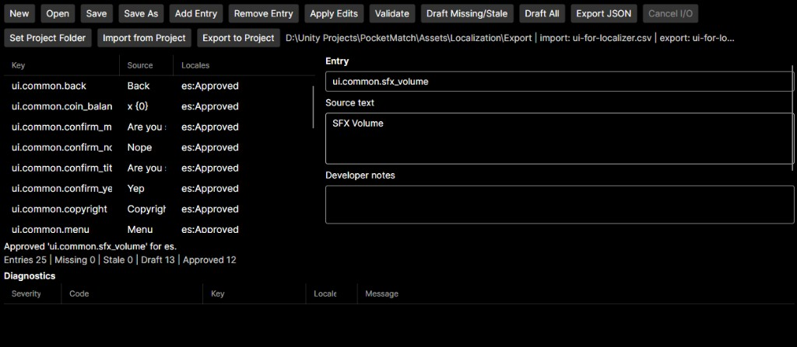

# Localizer

Local-first localization authoring and QA utility for .NET applications and games. A local model proposes drafts; deterministic code owns identity, validation, approval, and export. Consumers exchange files — they do not load Localizer assemblies.

[](https://github.com/TimoKuronen/Localizer/actions/workflows/ci.yml)
[](LICENSE)



## Highlights

- Engine-neutral catalog with stable keys, BCP 47 locales, and Draft/Approved workflow
- Derived Missing and Stale status from fingerprints so approved text survives source changes
- Deterministic validators for `plain` and indexed `composite` placeholders (`{0}`, `{1}`)
- Local Ollama drafting through a provider port; drafts stay unapproved until a human Approves
- Compact per-locale runtime JSON export and Unity Localization String Table CSV import/export
- Avalonia desktop host for catalog authoring, review, and project-folder handoff
- Layered Core / Application / Infrastructure / Desktop solution; dependencies point inward
- 118 NUnit tests across Core, Application, and Infrastructure (no network or model in CI)
- Ubuntu CI via GitHub Actions

## Architecture

```text
Localizer.Core
      ^
Localizer.Application
      ^
Localizer.Infrastructure
      ^
Localizer.Desktop
```

Pipeline intent: `Sources -> Neutral catalog -> Drafting and QA -> Review -> Generated outputs`.

Projects: `Localizer.Core` (domain, lifecycle, validation), `Localizer.Application` (ports and use cases), `Localizer.Infrastructure` (JSON persistence, Ollama drafting, compact locale export, Unity CSV adapters), `Localizer.Desktop` (Avalonia composition root), plus Core/Application/Infrastructure test projects.

Details: [docs/architecture.md](docs/architecture.md)

## Stack

- C# / .NET 10
- Avalonia
- [Ollama](https://ollama.com/) local HTTP API
- System.Text.Json
- NUnit

## Docs

- [Architecture](docs/architecture.md)
- [Catalog and format contract](docs/catalog-and-formats.md)

## License

[MIT](LICENSE)
